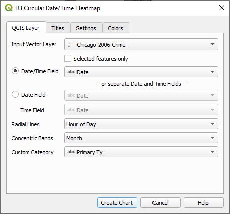
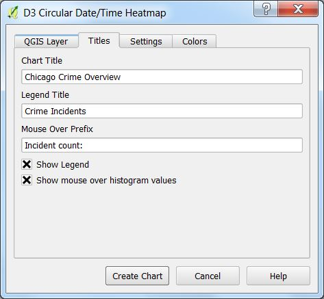
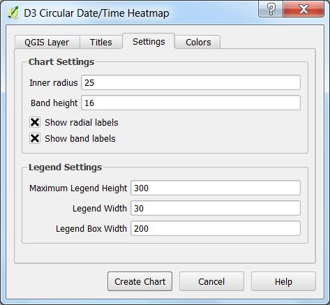
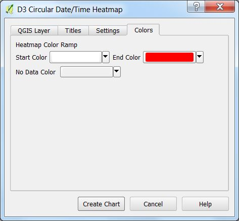
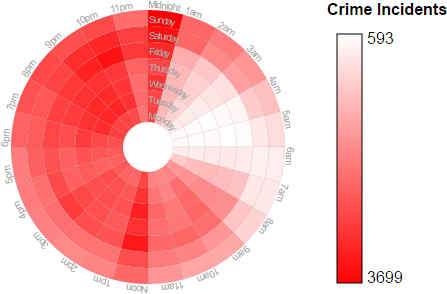
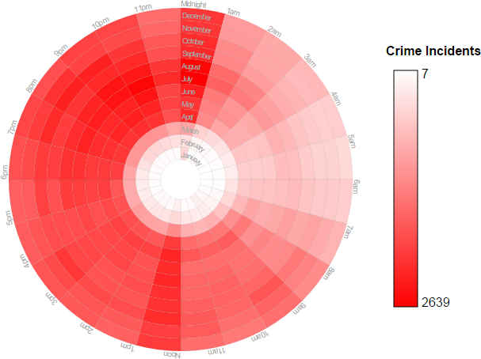
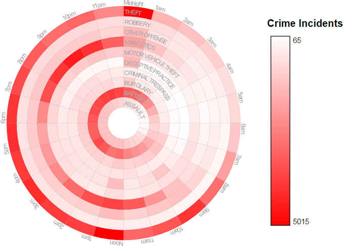

# QGIS D3 Date and Time Heatmap
This plugin creates a D3 circular histogram heatmap using date, time, and custom categories in the data. An optional legend can be included. 

The plugin works by counting the number of date/time/category events using two axis and displays the results as a circular heatmap. It allows you to analyze the temporal distribution of data and how much of it exists across time, based on two frequencies.

## QGIS Layer Tab
This tab is for choosing the vector layer that will be used for generating the heatmap chart. Additionally, date and time fields are selected. A field representing a category can be specified and the axis of the resulting chart is configured.

* **Input Vector Layer** - This is a list of all the vector layers in the QGIS project. Select the one that you want to work with.
* **Date/Time Field** - By checking the radio button next to this filed you can specify a field that contains a date/time column. This can either be a QDateTime column or a string representing a date and time. Date/time strings are parsed using the Python **dateutil** [<code>dateutil.parser.parse</code>](http://dateutil.readthedocs.io/en/stable/parser.html) parser. The format of the string must match one of the supported formats used by <code>dateutil</code>.
* **Date Field** - If the vector layer has separate columns for Date and Time then select this radio button and then select a field that contains a date.
* **Time Field** - This is enabled by checking the radio button next to the **Date Field**. Here you can choose a field that contains time.
* **Radial Lines** and **Concentric Bands** represent one of the following for their respective axis:
    * Year
    * Month
    * Day of Month
    * Day of Week
    * Hour of Day
    * Custom Category Field - Select this if you want to use one of the columns as a category along one of the axis. 
* **Custom Category** specifies one of the columns that represents a category that can be selected for the axis. Both **Radial Lines** and **Concentric Bands** can select this field. If there are too many unique values in the category column, then an error message will be generated. You can limit the number unique category values by setting a *Filter* on the layer. See the example below.

Note that it is not necessary to have both date and time information. In this case, select either the radial box representing date and time in the same column or separate date and time columns.

## Titles Tab
The chart title, legend title, and the mouse over prefix can be configured on this tab.

* **Chart Titles** - This text will be displayed as a header at the top of the page.
* **Legend Title** - If a legend is displayed, this is the text that will be displayed above it.
* **Mouse Over Prefix** - When ***Show mouse over histogram value*** is selected, whenever the mouse is over a part of the chart, the value of the pie segment will be displayed. This is the prefix that accompanies the pie segment value.
* **Show Legend** - Check this box to display the legend.
* **Show mouse over histogram value** - Check this to display the histogram value when the mouse is over a wedge of the heat map chart.

## Settings Tab
Chart and legend settings for the heat map can be configured on this tab.

**Chart Settings**

* **Inner radius** - The radius in pixels where the first band of the heatmap starts.
* **Band height** - Height in pixels of each band.
* **Show radial labels** - When checked, the radial labels will be displayed.
* **Show band labels** - When checked, the labels for each band will be displayed.

**Legend Settings**

The legend will be displayed to the right of the chart and these are its settings.

* **Maximum Legend Height** - Specifies the maximum height of the legend in pixels.
* **Legend Width** - Specifies the width of the legend bar in pixels.
* **Legend Box Width** - Specifies the overall D3 legend container width. This must be large enough to include the legend bar and labels.

## Colors Tab
These are settings for fine control over the heatmap color ramp and **No Data Color**

# Suggestions
Please send any suggestions to adenaculture@gmail.com or submit a ticket to the
[D3DataVis Issue tracker](https://github.com/NationalSecurityAgency/qgis-d3datavis-plugin/issues)

# Tutorial Examples
These examples make use of the [2006 Chicago crime data](https://data.cityofchicago.org/Public-Safety/Crimes-2001-to-present/ijzp-q8t2). In 2006 there were 367,968 crime incidents. That is a lot of crime during a year in just one city. Although this author is not trained in crime, some basic conclusions can be obtained by looking at the crime incidents based on the Month of the Year, Time of the Day, and Day of the Week. Here are the examples.

### Month of the year vs. day of the week.

By looking at this graph one can make some observations. The least amount of crime occurs during the months of January, February and March. This is probably due to the cold. If that is the case, why does December have a high crime rate? That is probably because of the holiday season. 

### Hour of the day vs. day of the week.

In this graph it appears that crime increases from 6pm to 11pm. The worst crime occurs from midnight to 1am. More difficult jobs must be taking place on the weekend where there is an increase of activity from 1am to 3am. During the day from Noon to 1pm there is also an increase of crime.

### Hour of the day vs. month of the year

Here one can see a similar pattern. Crime is less during January, February, and March. Crime increases starting from about 6pm to 11pm and then from Midnight to 1am plans are executed. This graph also shows the increased crime from Noon to 1pm.

### Hour of the day vs custom crime category
In this example the input data has been filtered by setting a QGIS filter for only certain types of crime. For this Example, right-mouse click on the Chicago crime layer in QGIS and select **Filter** then use the following filter:

    "Primary Ty" IN ('THEFT','ROBBERY','OTHER OFFENSE','NARCOTICS',
        'MOTOR VEHICLE THEFT','DECEPTIVE PRACTICE','CRIMINAL TRESPASS',
        'BURGLARY','BATTERY','ASSAULT')

Set the following to:

* **Radial Lines** - *Hour of Day*
* **Concentric Bands** - *Custom Category Field*
* **Custom Category** - *Primary Ty*

This shows the resulting chart that is created.

