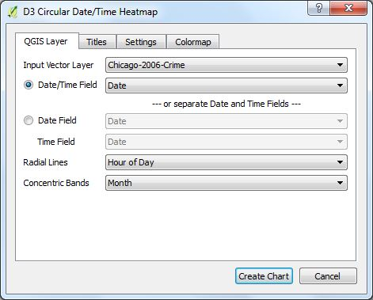
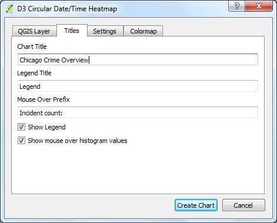
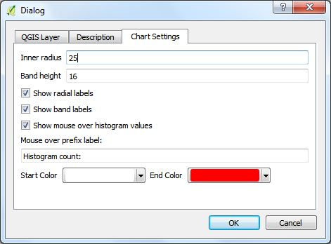
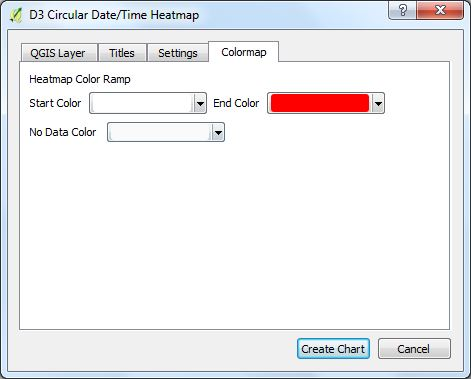
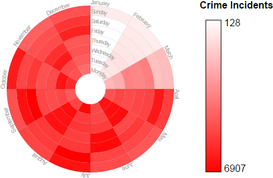
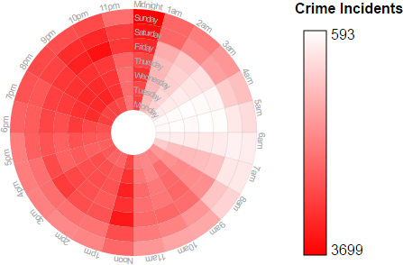
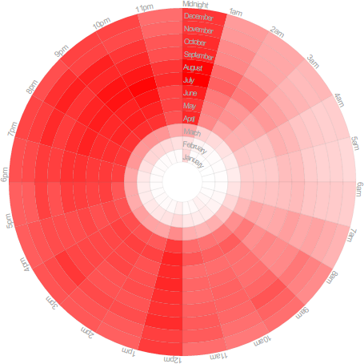

# QGIS D3 Date and Time Heatmap
This plugin is used to create D3 circular histogram heat maps based on date and time fields in the data. It can also create a legend. The ***QGIS Layer*** tab allows for the selection of the vector layer and the date and time fields.

**Input Vector Layer** is a list of all the vector layers in your QGIS project. If your data has a field that is either a QDateTime or a string representing a date and time, then select "Date/Time Field" and select the column. If the data has separate columns for Date and Time then select the radio button next to the "Date Field" and then select the various columns for Date and Time. Choose what the "Radial Lines" and "Concentric Bands" should represent. The options are:

* Year
* Month
* Day of Month
* Day of Week
* Hour of Day

The ***Titles*** tab provides selection of the chart title, the title given to the legend, and the mouse over prefix.

* **Chart Titles** - Text entered here will be displayed at the top of the page.
* **Legend Title** - If a legend is displayed this is the text that will be displayed above it.
* **Mouse Over Prefix** - When ***Show mouse over histogram value*** is selected, when ever that mouse is over a part of the chart, the value of the pie segment will be displayed and this is the prefix that accompanies it.
* **Show Legend** - Check this box to have the legend be displayed.
* **Show mouse over histogram value** - Check this to display the histogram value when the mouse is over a wedge of the heat map chart.

The **Settings** tab provides chart settings for the heat map chart as well as the legend.

Finally, the **Colormap** tab provides fine control over the heat map color ramp and no data color. Eventually, graduated color maps will be supported.

## Examples
These examples make use of the [2006 Chicago crime data](https://data.cityofchicago.org/Public-Safety/Crimes-2001-to-present/ijzp-q8t2). In 2006 there were 367,968 crime incidents. That is a lot of crime for one year in just one city. Although this author is not trained in crime, some basic conclusions can be obtained by looking at the crime incidents based on the Month of the Year, Time of the Day, and Day of the Week. Here are the examples.

### Month of the year vs day of the week.

By looking at this graph one can make some observations. The least amount of crime occurs during the months of January, February and March. This is probably due to the cold. If that is the case why does December have a high crime rate? That is probably because of the holiday season. 

### Hour of the day vs day of the week.

In this graph it appears that crime increases from 6pm to 11pm. The worst crime occurs from midnight to 1am. More difficult jobs must be taking place on the weekend where there is an increase of activity from 1am to 3am. During the day from Noon to 1pm there is also an increase of crime.

### Hour of the day vs month of the year

Here we see a similar pattern. Crime is less during January, February, and March. Crime increases starting from about 6pm to 11pm and then from Midnight to 1am plans are executed. This graph also shows the increased crime from Noon to 1pm.
